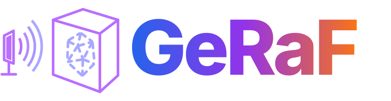
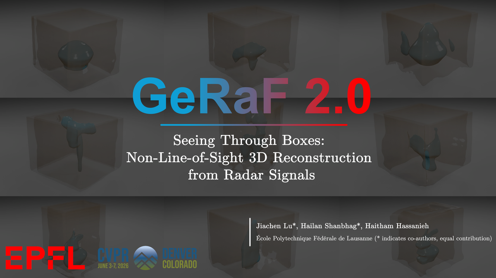

<div align="center">



# Neural Geometry Reconstruction from Radio Frequency Signals

[](https://arxiv.org/abs/2605.29097)
[](https://arxiv.org/abs/2605.29098)
[](https://ftpsens.epfl.ch/geraf/)

</div>


<div align="center">
  <a href="https://www.youtube.com/watch?v=EiE2zqjBVkg">
    
  </a>
</div>

## 📄 Abstract

### GeRaF 2.0 — Seeing through Boxes: Non-Line-of-Sight 3D Reconstruction from Radar Signals (CVPR 2026)

[arXiv](https://arxiv.org/abs/2605.29098) | [Paper](https://openaccess.thecvf.com/content/CVPR2026/papers/Lu_Seeing_through_boxes_Non-Line-of-Sight_3D_Reconstruction_from_Radar_Signals_CVPR_2026_paper.pdf)

Modern vision methods reconstruct 3D geometry from multi-view images with remarkable
fidelity — but they fundamentally cannot see objects that are hidden from view. We present
**GeRaF 2.0**, a framework for *non-line-of-sight 3D reconstruction* that uses millimeter-wave
radar to image objects sealed inside an opaque box. Because radio-frequency signals penetrate
common materials cheaply and safely, radar recovers both the enclosing box and the object inside
it. Unlike a camera, a radar array has no aperture — a *lensless* imaging regime in which the raw
signal is indistinguishable from noise. GeRaF 2.0 casts radar reconstruction as a differentiable,
physically grounded rendering problem: we sample points along rays, predict a *unified
line-of-sight signed distance function* with an MLP, and simulate the FMCW radar signal to compare
against the measured radar image. To resolve the surface-level ambiguity inherent to mixed
line-of-sight and non-line-of-sight regions, we anchor the geometry by enforcing consistency
between vision- and radar-derived SDFs in the shared line-of-sight region. GeRaF 2.0 recovers
accurate surfaces and shapes for both the outer box and the enclosed object.

### GeRaF 1.0 — GeRaF: Neural Geometry Reconstruction from Radio-Frequency Signals (NeurIPS 2025 Spotlight)

[arXiv](https://arxiv.org/abs/2605.29097) | [Paper](https://openreview.net/pdf?id=z3PMVmzoya)

**GeRaF** is the first method to use neural implicit learning for near-range 3D geometry
reconstruction from radio frequency (RF) signals. Unlike RGB or LiDAR-based methods, RF sensing
can see through occlusion but suffers from low resolution and noise due to its lensless imaging
nature. While lenses in RGB imaging constrain sampling to 1D rays, RF signals propagate through the
entire space, introducing significant noise and leading to cubic complexity in volumetric
rendering. Moreover, RF signals interact with surfaces via specular reflections, requiring
fundamentally different modeling. To address these challenges, GeRaF (1) introduces filter-based
rendering to suppress irrelevant signals, (2) implements a physics-based RF volumetric rendering
pipeline, and (3) proposes a novel lensless sampling and lensless alpha blending strategy that
makes full-space sampling feasible during training. By learning signed distance functions,
reflectiveness, and signal power through MLPs and trainable parameters, GeRaF takes the first step
towards reconstructing millimeter-level geometry from RF signals in real-world settings.

## 🔔 Updates

- **2026-05-29** — First commit: initial public release of the GeRaF training and testing code.

### 📌 To-do

- [ ] Release the dataset.
- [ ] Release the pre-trained checkpoints.
- [ ] Deactivate the vision data before release.

## 🧭 About This Repository

This repo is the lightweight setup for **GeRaF training and testing**, built on plain
PyTorch. It follows a **config + registry** pattern: every component — model, dataset,
transform, hook — is declared as a plain `dict` with a `type` field and instantiated from a
Python config, so experiments are defined by config files rather than code changes. A small
custom training loop drives training with `train.py` and mesh / volume
prediction with `test.py`; setup is via `uv` locally or Docker for containers.

### Configs (`configs/`)

Python configs with `_base_` inheritance (resolved by
[geraf/utils/config.py](geraf/utils/config.py)). A config wires together the `model`, the
`train` / `val` dataloaders, the shared `radar` and `sample_cfg` blocks, the schedule, and the
hooks.

- `configs/_base_/` — shared fragments (radar + matched-filter setup, schedules, runtime)
- `configs/geraf/` — GeRaF RF-reconstruction experiments, e.g. `geraf2_bunnyboxv1_stage1` /
  `stage2`
- `configs/neus/` — RGB NeuS pretraining that supplies the vision SDF prior used by stage 2
- `configs/rfprocess/` — matched-filter / data-processing configs

### The `geraf/` package

The framework code, grouped by registry (`MODELS`, `DATASETS`, `TRANSFORMS`). Components
self-register with `@<REGISTRY>.register_module()` and are built from the config's `type`.

- `geraf/models/` — models (`GeRaFStage1`, `GeRaFStage2`, `NeusRendering`), `networks/`
  (SDF, deviation, signal / color), `rendering/`, and `model_utils/` (the differentiable ray
  tracer and matched filter)
- `geraf/datasets/` — datasets (`RFDataset`, `RFEvalDataset`, `RGBDataset`, `MeshDataset`) and
  `transforms/` (the data pipeline: load RF + antenna positions, normalize to the unit sphere,
  sample rays, pack inputs)
- `geraf/ops/` — CUDA extensions: `RFSignalTracer` and `RFMatchedFilter`
- `geraf/hooks/`, `geraf/utils/` — visualization / step hooks and the registry + config loader

### Dataset layout

GeRaF uses two data sources: **RGB** captures (the vision SDF prior, under `data/rgb/custom/`) and
**RF** matched-filter volumes (the radar reconstruction target, under `data/rf/process/`).
`RFDataset` / `RFEvalDataset` read one processed RF object folder, captured as `N`
sub-acquisitions (the `_sub<N>` suffix):

```text
data/rf/process/<obj>_sub<N>/
├── <obj>_sub<N>.npy          # aggregated matched-filter volume (accmf)
└── mf/<idx>_<angle>_<sub>/    # one folder per radar frame
    ├── sarimage.bin           # matched-filter SAR cube, float32 (Nx×Ny×Nz)
    ├── rpos.npy / tpos.npy     # receive / transmit antenna positions
    └── ...
```

See **[docs/PrepareData.md](docs/PrepareData.md)** for the full RGB and RF data structure and
download instructions.


## 📦 Installation

### Requirements

- Linux
- Python 3.11 recommended
- NVIDIA GPU for training / fast inference
- PyTorch 2.4.1 with CUDA 12.1

We recommend using **[uv](https://github.com/astral-sh/uv)** to reproduce the exact Python
environment. This repo ships:

- [pyproject.toml](pyproject.toml) for dependency definitions
- [uv.lock](uv.lock) for exact dependency resolution
- `uv` source configuration for CUDA 12.1 PyTorch wheels
- [setup_env.sh](setup_env.sh) as a convenience wrapper

### Option 1: one-command setup

```bash
bash setup_env.sh
source venv/bin/activate
```

This will:

- create `venv/`
- sync dependencies with `uv`
- build the CUDA extensions in place

### Option 2: manual `uv sync`

```bash
export UV_CACHE_DIR=$PWD/.cache
export UV_PROJECT_ENVIRONMENT=$PWD/venv
uv sync --python 3.11 --frozen
source venv/bin/activate
python setup.py build_ext --inplace
```

Notes:

- `uv sync --frozen` recreates the exact environment from `uv.lock`
- the CUDA extensions are still built separately with `python setup.py build_ext --inplace`
- this is more portable than copying `venv/` between machines

> **Other options.** Prefer not to use `uv`? Installation via `requirements.txt` and the full
> Docker workflow (cluster build / run) are documented in
> **[docs/installation.md](docs/installation.md)**.

### Native (CUDA) extensions

Both setup paths above build the CUDA ops in place. To rebuild them manually:

```bash
python setup.py build_ext --inplace
```

The extensions are `geraf/ops/RFSignalTracer` and `geraf/ops/RFMatchedFilter`.

## 🚀 Usage

### Training

GeRaF is trained in three stages — vision pretraining, then two RF stages — each launched with
`tools/train.py <config>`.

**Step 1 — Vision pretraining** (RGB NeuS prior used by stage 2):

```bash
python tools/train.py configs/neus/boxv1/neus_boxv1.py
```

**Step 2 — Stage 1 training**:

```bash
python tools/train.py configs/geraf/bunnyboxv1/geraf2_bunnyboxv1_stage1.py
```

**Step 3 — Stage 2 training** (loads the stage-1 model and the vision SDF prior):

```bash
python tools/train.py configs/geraf/bunnyboxv1/geraf2_bunnyboxv1_stage2.py
```

Or run all three stages at once with the pipeline runner, which chains the checkpoints between
stages automatically:

```bash
python tools/overall_train.py configs/pipelines/bunnyboxv1.py
```

**Output and logs.** By default a run writes to `work_dirs/<config_name>/`:

- checkpoints: `latest.pth` and periodic `iter_<N>.pth`
- logs: `work_dirs/<config_name>/logs/train_<YYYYMMDD_HHMMSS>.log`

Override the directory with `--work-dir <dir>`, and resume from `latest.pth` with `--resume`.

### Testing

Run prediction / mesh extraction from a config and a trained checkpoint:

```bash
python tools/test.py configs/geraf/bunnyboxv1/geraf2_bunnyboxv1_stage2.py work_dirs/geraf2_bunnyboxv1_stage2/latest.pth --save-mesh
```

**What you get.** With `--save-mesh`, the reconstructed surface is written to
`work_dirs/<config_name>/mesh.ply`, alongside the projection / mesh images produced by the
visualization hook. Pass `--save-mesh <dir>` to redirect the outputs, or omit `--save-mesh` to
run prediction and visualization without writing the mesh. The test set is reduced to a single
sample for fast mesh extraction.

## ⚖️ License

This code is released under the [PolyForm Noncommercial License 1.0.0](LICENSE). Use is permitted for research, education, and other noncommercial purposes. For commercial use, please contact the authors.

## 📚 Citation

If you find GeRaF useful, please cite:

```bibtex
@inproceedings{lu2026seeing,
  title     = {Seeing through boxes: Non-Line-of-Sight 3D Reconstruction from Radar Signals},
  author    = {Lu, Jiachen and Shanbhag, Hailan and Al Hassanieh, Haitham},
  booktitle = {Proceedings of the IEEE/CVF Conference on Computer Vision and Pattern Recognition (CVPR)},
  year      = {2026}
}

@inproceedings{lu2025geraf,
  title     = {GeRaF: Neural Geometry Reconstruction from Radio-Frequency Signals},
  author    = {Lu, Jiachen and Shanbhag, Hailan and Al Hassanieh, Haitham},
  booktitle = {Advances in Neural Information Processing Systems (NeurIPS)},
  year      = {2025}
}
```
